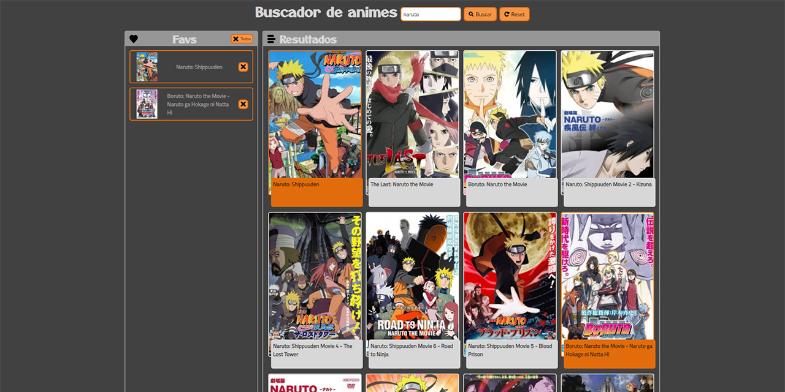

# Buscador de series de anime

Buscador de series de anime que utiliza una API pública y te permite guardar tus animes favoritos. Puedes añadir o quitar los favoritos y estos se guardan en el local storage de tu navegador.

[](https://github.com/PaulaEPR)
[](https://github.com/tterb/atomic-design-ui/blob/master/LICENSEs)

### ¿Dónde verlo?

[Buscador de series de anime](https://paulaepr.github.io/buscador-series-anime/)



---
## Instalación y configuración

**Requerimientos:** Necesitas tener `node` y `npm` instalados.

### Clonar el repositorio

```
git clone URL
```

### Instalar las dependencias

```
npm install
```

### Ejecutar la aplicación

```
npm start
```

Ve a [http://localhost:3000](http://localhost:3000) para ver la app en el navegador.

### Desplegar el entorno de producción

```
npm run deploy
```
---

## Javascript: Ejercicio de evaluación

El ejercicio consiste en hacer un buscador de series en Javascript con los siguientes requerimientos:

### 1. Estructura básica

- [x]  Un campo de texto y un botón para buscar series por su título.
- [x]  Un listado de resultados de búsqueda donde aparece el cartel de la serie y el título.

### 2. Búsqueda

- [x]  Al hacer clic sobre el botón de Buscar, la aplicación debe conectarse al [API](https://jikan.docs.apiary.io/#reference/0/search/search-request-example+schema?console=1)
- [x]  Para construir la URL de búsqueda hay que recoger el texto que ha introducido la usuaria en el
campo de búsqueda.
- [x]  Por cada serie contenido en el resultado de la búsqueda hay que pintar una tarjeta donde mostramos una imagen de la serie y el título.
- [x]  Algunas de las series que devuelve el API no tienen imagen. En ese caso hay que mostrar una imagen de relleno.
- [x]  Para pintar la información en la página se puede elegir entre hacerlo de forma básica con innerHTML o manipulando de forma avanzada el DOM.

### 3. Favoritos

Al hacer clic sobre una serie debe pasar lo siguiente:

- [x]  El color de fondo y el de fuente se intercambian, indicando que es una serie favorita.
- [x]  Hay que mostrar un listado en la parte izquierda de la pantalla, debajo del formulario de búsqueda, con las series favoritas.
- [x]  Os recomendamos crear un variable o constante de tipo array en JS para almacenar las series favoritas.
- [x]  Las series favoritas deben seguir apareciendo a la izquierda aunque la usuaria realice otra búsqueda.

### 4. Almacenamiento local

- [x]  Hay que almacenar el listado de favoritos en el localStorage.
- [x]  Al recargar la página el listado de favoritos debe mostrarse.

### 5. BONUS: Borrar favoritos

- [x]  Al hacer clic sobre el icono de una 'x' al lado de cada favorito, hay que borrar el favorito clicado de la lista y del localStorage.
- [x]  Poder añadir/quitar como favorito al hacer clic sobre una serie del lado de la derecha.
- [x]  Si realizamos una nueva búsqueda y sale una serie que ya es favorita, aparezca ya resaltada en los resultados de búsqueda (con colores de fondo y texto intercambiados).
- [x]  Al final de la lista de favoritos haya un botón para borrar todos los favoritos a la vez.

### 6. BONUS: Afinar la maquetación

- [x]  Libertad para decidir los estilos.